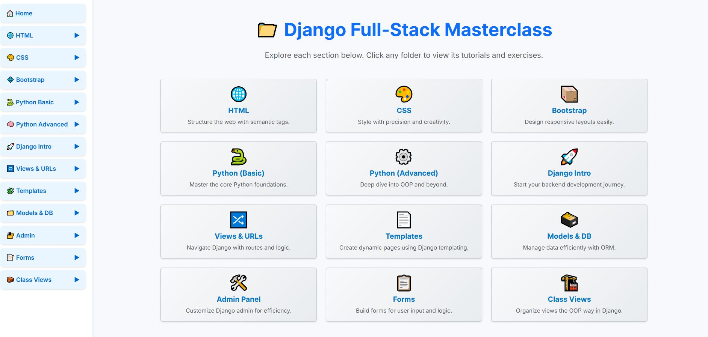

# 🗂️ Django Masterclass Portfolio


A full-stack Django portfolio showcasing key concepts in backend web development. This project is structured as an interactive learning platform with dedicated folders and exercises covering HTML, CSS, Python, Django fundamentals, forms, models, templates, class-based views, and more.



---

## 📌 Project Purpose

To consolidate and demonstrate core Django development skills in a structured, interactive way. This portfolio serves both as a personal learning guide and a showcase of professional Django practices.

---

## 🌟 Key Features

- 📁 Interactive folder-based navigation
- 🌐 HTML & CSS modules
- 🎨 Bootstrap 5 responsive styling
- 🐍 Python Basics & OOP (Advanced)
- 🚀 Django Intro + URL routing
- 🧩 Template inheritance and filters
- 🗃️ Models + ORM for DB interaction
- 🛠️ Custom Django Admin
- 🧾 User input using Forms
- 📦 Class-based views for cleaner code
- 🧪 Real-world examples + interactive quizzes

---

## 🛠️ Tech Stack

- Python 3.x
- Django 4.x
- Bootstrap 5
- JavaScript
- Git + GitHub

---

## 🚀 How to Run Locally

### 1. Clone this repo:

```bash
git clone https://github.com/aminul-portfolio/django_masterclass_portfolio.git
cd django_masterclass_portfolio
```

### 2. Create and activate virtualenv:

```bash
python -m venv env
# Windows:
env\Scripts\activate
# macOS/Linux:
source env/bin/activate
```

### 3. Install dependencies:

```bash
pip install -r requirements.txt
```

### 4. Run server:

```bash
python manage.py runserver
```

Visit: [http://127.0.0.1:8000](http://127.0.0.1:8000)

---

## 🌐 Optional: Deployment

This project can be deployed on [https://www.pythonanywhere.com](https://www.pythonanywhere.com), Render, or Railway. Let me know if you'd like full steps for one of these!

---

## 🖼 Screenshot

Make sure to place the screenshot image in:

```
images/django_masterclass.jpg
```

---

## 📚 Learning Objectives

- Learn Django in a modular, topic-based format
- Practice real-world backend techniques
- Showcase your portfolio to employers or mentors
- Prepare for job interviews and freelancing

---

## 📄 License

This project is open-source and licensed under the [MIT License](LICENSE).

---

## 🙋‍♂️ Author

**Aminul Islam (Sumon)**  
📬 [GitHub Profile](https://github.com/aminul-portfolio)  
💼 Django Developer | Data Analyst in Progress
